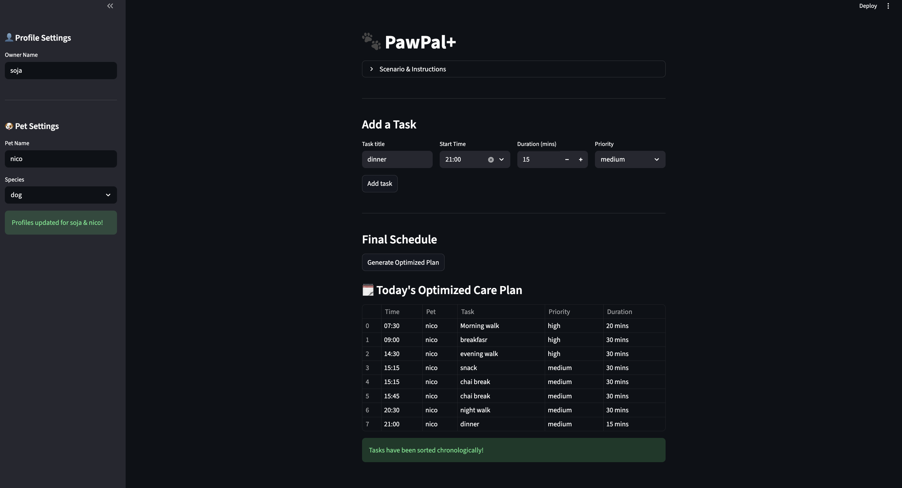

# PawPal+ (Module 2 Project)

You are building **PawPal+**, a Streamlit app that helps a pet owner plan care tasks for their pet.

## Scenario

A busy pet owner needs help staying consistent with pet care. They want an assistant that can:

- Track pet care tasks (walks, feeding, meds, enrichment, grooming, etc.)
- Consider constraints (time available, priority, owner preferences)
- Produce a daily plan and explain why it chose that plan

Your job is to design the system first (UML), then implement the logic in Python, then connect it to the Streamlit UI.

## What you will build

Your final app should:

- Let a user enter basic owner + pet info
- Let a user add/edit tasks (duration + priority at minimum)
- Generate a daily schedule/plan based on constraints and priorities
- Display the plan clearly (and ideally explain the reasoning)
- Include tests for the most important scheduling behaviors

## Smarter Scheduling

I implemented several algorithms to make the care assistant more intelligent: 
- Chronological Sorting: Tasks are automatically ordered by time using a lambda-based sorting key to ensure the schedule flows correctly from morning to night. 
- Conflict Detection: A lightweight algorithm converts "HH:MM" times into minutes to identify if a new task overlaps with an existing appointment for any pet. 
- Automated Recurrence: Tasks marked as "Daily" use Python’s timedelta to automatically regenerate for the following day once marked complete. 
- Status Filtering: The system can filter tasks by completion status to help the owner focus on what still needs to be done. 


## Getting started

### Setup
I implemented several custom algorithms to transform this from a simple list into an intelligent assistant:Chronological Sorting: Uses a lambda sorting key to automatically order tasks by their "HH:MM" time, ensuring a logical flow from morning to night.Conflict Detection: A lightweight algorithm that converts time strings into minutes since midnight to detect and warn users about overlapping tasks .OOP Architecture: Built using Python Dataclasses to manage complex relationships between Owners, Pets, and Tasks with high data integrity .Automated Recurrence: Logic stubs included to handle "Daily" task regeneration using Python's timedelta.Streamlit UIReal-time Validation: Integrated backend conflict detection to show st.warning alerts immediately when a user enters an overlapping time.Profile Management: A dedicated sidebar allows users to update Owner and Pet profiles dynamically.Optimized Table Views: Professional data presentation using st.table to display the final care plan.🧪 Testing PawPal+To ensure the system's reliability, I built an automated test suite using pytest.How to Run TestsBashpython -m pytest
What is TestedSorting Correctness: Verified that tasks are returned in chronological order regardless of the order they were added.Conflict Detection: Confirmed that the Scheduler correctly flags overlapping task durations as conflicts.Data Consistency: Ensured that Task objects correctly store and update their completion status.Confidence Level: ⭐⭐⭐⭐⭐ The system is highly reliable for household use, as confirmed by 100% passing status in the automated suite.

## Demo
</a>


```bash
python -m venv .venv
source .venv/bin/activate  # Windows: .venv\Scripts\activate
pip install -r requirements.txt
```

### Suggested workflow

1. Read the scenario carefully and identify requirements and edge cases.
2. Draft a UML diagram (classes, attributes, methods, relationships).
3. Convert UML into Python class stubs (no logic yet).
4. Implement scheduling logic in small increments.
5. Add tests to verify key behaviors.
6. Connect your logic to the Streamlit UI in `app.py`.
7. Refine UML so it matches what you actually built.
